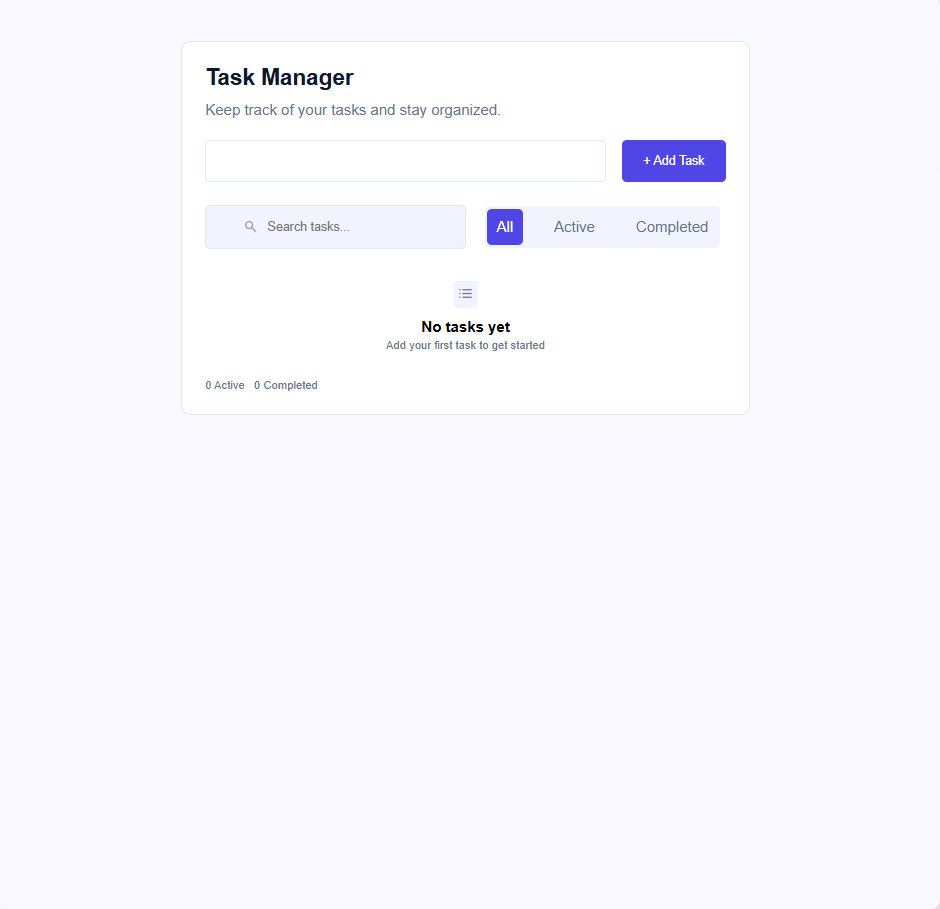
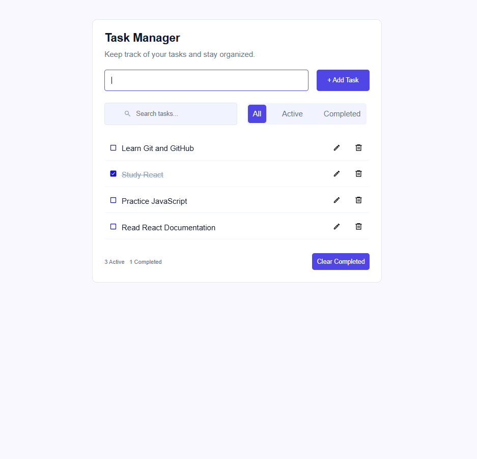
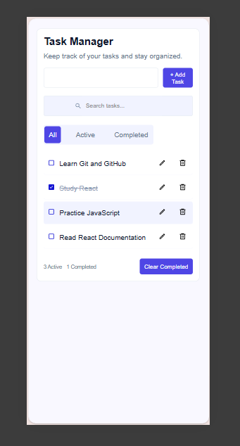
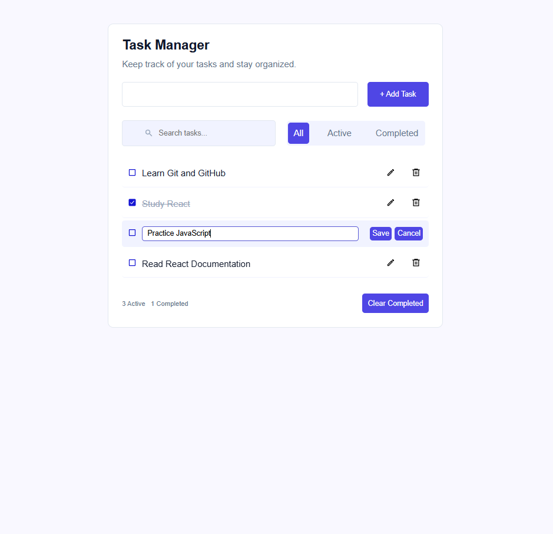
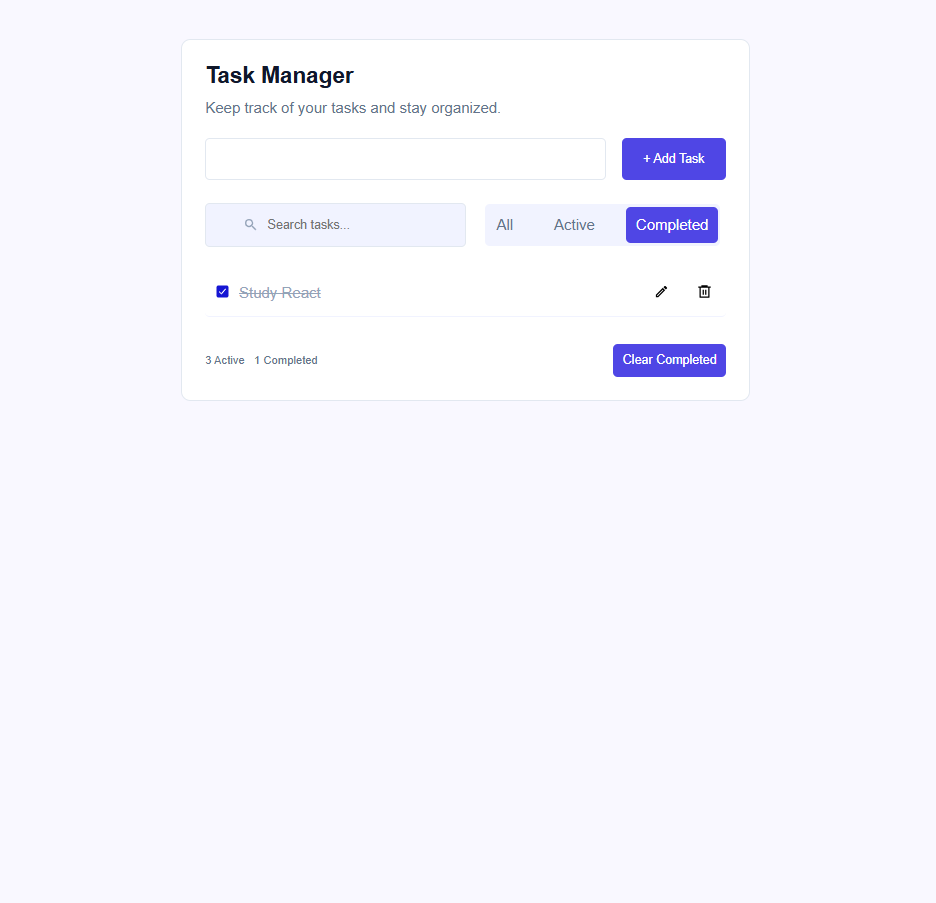

# Todo App

A simple and modern task manager built with React.

The project allows users to create, edit, delete, search, filter, and complete their tasks. Tasks are also saved in the browser using Local Storage.

## Features

- Add new tasks
- Edit existing tasks
- Delete tasks
- Mark tasks as completed
- Search tasks
- Filter tasks by:
  - All
  - Active
  - Completed
- Clear completed tasks
- Display active and completed task counts
- Display an empty state when there are no tasks
- Display a message when no tasks match the current search or filter
- Persist tasks using Local Storage
- Responsive design for desktop and mobile
- Clean and reusable React components

## Built With

- React
- JavaScript
- CSS
- React Icons
- Local Storage
- Vite

## Screenshots

### Empty State

The initial state when there are no tasks.



### Tasks

The main application view with multiple tasks.



### Mobile Responsive View

The application adapted for smaller screen sizes.



### Edit Task

Editing an existing task.



### Task Filters

Filtering tasks by All, Active, and Completed.



## Getting Started

### Prerequisites

Make sure you have Node.js installed on your machine.

### Installation

Clone the repository:

```bash
git clone https://github.com/Eman-Ahmed1/task-manager.git
```

Navigate to the project directory:

```bash
cd task-manager
```

Install the dependencies:

```bash
npm install
```

Start the development server:

```bash
npm run dev
```

The application will be available at the local development URL shown in your terminal.

## What I Learned

While building this project, I practiced:

- Managing state with `useState`
- Using `useEffect`
- Passing data between components using props
- Handling user events
- Rendering lists with `map()`
- Filtering data with `filter()`
- Implementing search functionality
- Implementing filtering logic
- Conditional rendering
- Updating objects inside arrays
- Working with Local Storage
- Using `JSON.stringify()` and `JSON.parse()`
- Creating reusable React components
- Building responsive layouts with CSS
- Organizing a React project into reusable components

## Author
Eman Ahmed Kamal